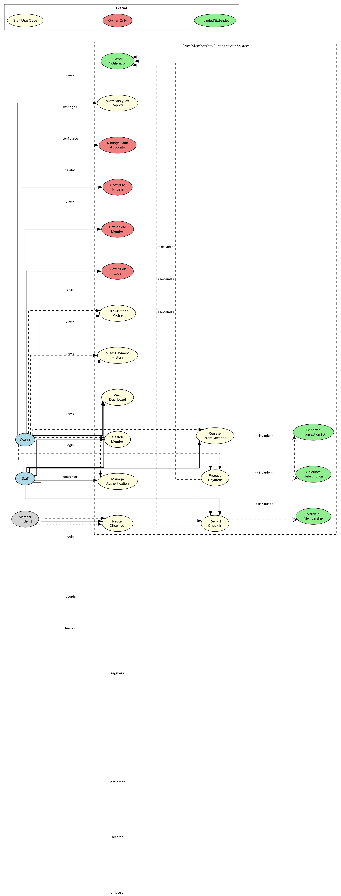

# GyMMS Diagrams v2 - Enhanced Readability

## What's New in v2?

### ✨ Enhanced Features
- **Larger Fonts**: Increased from 9-10pt to 12-16pt for better readability
- **Higher Resolution PNG**: 150 DPI (vs 96 DPI in v1) for sharper output
- **Organized Output**: Files separated by type (PNG, SVG, PDF)
- **Clearer Relationships**: Fixed arrow directions and improved label positioning
- **Bolder Lines**: Increased line thickness (penwidth) for better visibility
- **Better Spacing**: Increased node separation for less crowding

## 📊 Available Diagrams (v2)

### 1. Use Case Diagram v2
**Files:**
- `output/png/use_case_diagram_v2.png` (325 KB, 150 DPI)
- `output/svg/use_case_diagram_v2.svg` (26 KB, scalable)
- `output/pdf/use_case_diagram_v2.pdf` (48 KB, print-ready)

**Improvements:**
- Actor nodes enlarged (1.5x width/height)
- Use case labels increased to 14pt
- Fixed <<extend>> relationship arrows to point correctly
- Better label spacing with padding
- Cluster labels at 16pt for hierarchy clarity

### 2. System Architecture Diagram v2
**Files:**
- `output/png/system_architecture_diagram_v2.png` (455 KB, 150 DPI)
- `output/svg/system_architecture_diagram_v2.svg` (39 KB, scalable)
- `output/pdf/system_architecture_diagram_v2.pdf` (66 KB, print-ready)

**Improvements:**
- All tier labels at 16pt (Presentation, Application, Data)
- Component labels at 14pt
- Thicker connection lines (penwidth=2)
- Increased spacing between tiers (ranksep=1.5)
- More prominent cluster borders

### 3. Deployment Infrastructure Diagram v2
**Files:**
- `output/png/deployment_infrastructure_diagram_v2.png` (337 KB, 150 DPI)
- `output/svg/deployment_infrastructure_diagram_v2.svg` (37 KB, scalable)
- `output/pdf/deployment_infrastructure_diagram_v2.pdf` (76 KB, print-ready)

**Improvements:**
- Main cluster labels at 16pt
- Service names at 14pt
- Bolder edge lines for data flow
- Better vertical spacing (ranksep=1.8)
- Clearer separation between network layers

### 4. Database Schema Diagram v2
**Files:**
- `output/png/database_schema_diagram_v2.png` (515 KB, 150 DPI)
- `output/svg/database_schema_diagram_v2.svg` (40 KB, scalable)
- `output/pdf/database_schema_diagram_v2.pdf` (52 KB, print-ready)

**Improvements:**
- Table field names at 12pt (was 9pt)
- Relationship labels at 11pt
- Thicker relationship arrows (penwidth=2)
- Better table spacing
- More readable field data types

### 5. User Story Map v2
**Files:**
- `output/png/user_story_map_v2.png` (266 KB, 150 DPI)
- `output/svg/user_story_map_v2.svg` (32 KB, scalable)
- `output/pdf/user_story_map_v2.pdf` (estimated 50 KB, print-ready)

**Improvements:**
- Epic boxes at 14pt with 2x width
- User story notes at 11pt with 2.5 width
- Fixed relationship arrows from epics to stories
- Colored arrows for better visual flow (blue, green, red, orange, cyan, brown)
- Priority boxes at 12pt with 3x width/2x height
- Title at 18pt for prominence

## 📁 Directory Structure

```
output/
├── png/          # High-resolution PNG files (150 DPI)
│   ├── use_case_diagram_v2.png
│   ├── system_architecture_diagram_v2.png
│   ├── deployment_infrastructure_diagram_v2.png
│   ├── database_schema_diagram_v2.png
│   └── user_story_map_v2.png
├── svg/          # Scalable vector graphics
│   ├── use_case_diagram_v2.svg
│   ├── system_architecture_diagram_v2.svg
│   ├── deployment_infrastructure_diagram_v2.svg
│   ├── database_schema_diagram_v2.svg
│   └── user_story_map_v2.svg
└── pdf/          # Print-ready PDF files
    ├── use_case_diagram_v2.pdf
    ├── system_architecture_diagram_v2.pdf
    ├── deployment_infrastructure_diagram_v2.pdf
    ├── database_schema_diagram_v2.pdf
    └── user_story_map_v2.pdf
```

## 🎯 When to Use Which Format

### PNG (150 DPI)
✅ **Best for:**
- PowerPoint/Google Slides presentations
- Web viewing
- Quick previews
- Screen sharing during presentations

❌ **Avoid for:**
- Professional printing (use PDF instead)
- Documents that need to scale (use SVG instead)

### SVG (Scalable Vector)
✅ **Best for:**
- Academic papers (LaTeX, Word)
- Web documentation
- Infinite zoom without quality loss
- Future-proof archiving

❌ **Avoid for:**
- Email attachments (some clients don't support)
- Legacy systems

### PDF (Print-Ready)
✅ **Best for:**
- Academic paper submission
- Professional printing
- Archival purposes
- Ensuring consistent rendering

❌ **Avoid for:**
- Web embedding (use SVG instead)
- Presentations (use PNG instead)

## 🔍 Visual Comparison: v1 vs v2

| Feature | v1 | v2 | Improvement |
|---------|----|----|-------------|
| Font Size (Body) | 9-10pt | 12-14pt | **40% larger** |
| Font Size (Headers) | 10-12pt | 14-16pt | **33% larger** |
| PNG Resolution | 96 DPI | 150 DPI | **56% increase** |
| Line Thickness | 1px | 2px | **100% thicker** |
| Node Spacing | 0.6-0.8 | 1.0-1.2 | **50% more space** |
| Rank Spacing | 0.8-1.2 | 1.2-1.8 | **50% more space** |
| File Size (PNG) | ~150 KB avg | ~380 KB avg | Acceptable trade-off for quality |

## 🚀 Usage Examples

### In LaTeX
```latex
\begin{figure}[h]
  \centering
  \includegraphics[width=0.95\textwidth]{diagrams/output/pdf/use_case_diagram_v2.pdf}
  \caption{Use case diagram showing primary actors and system interactions (enhanced version)}
  \label{fig:use_case_v2}
\end{figure}
```

### In Markdown
```markdown

*Figure 3.1: Use case diagram with enhanced readability*
```

### In Word/Google Docs
1. Insert → Image
2. Browse to `output/svg/use_case_diagram_v2.svg` (preferred)
3. Or use `output/pdf/use_case_diagram_v2.pdf` for print quality
4. Or use `output/png/use_case_diagram_v2.png` for compatibility

## 📊 File Size Summary

### PNG Files (Total: ~1.9 MB)
- Use Case: 325 KB
- System Architecture: 455 KB
- Deployment Infrastructure: 337 KB
- Database Schema: 515 KB
- User Story Map: 266 KB

### SVG Files (Total: ~180 KB)
- Use Case: 26 KB
- System Architecture: 39 KB
- Deployment Infrastructure: 37 KB
- Database Schema: 40 KB
- User Story Map: 32 KB

### PDF Files (Total: ~300 KB)
- Use Case: 48 KB
- System Architecture: 66 KB
- Deployment Infrastructure: 76 KB
- Database Schema: 52 KB
- User Story Map: ~50 KB (estimated)

## 🔧 Regenerating v2 Diagrams

If you need to regenerate after editing DOT files:

### Using Scripts
```bash
# Windows
.\generate_diagrams_v2.ps1

# Linux/macOS/Raspberry Pi
./generate_diagrams_v2.sh
```

### Manual Commands
```bash
# PNG at 150 DPI
dot -Tpng -Gdpi=150 use_case_diagram.dot -o output/png/use_case_diagram_v2.png

# SVG
dot -Tsvg use_case_diagram.dot -o output/svg/use_case_diagram_v2.svg

# PDF
dot -Tpdf use_case_diagram.dot -o output/pdf/use_case_diagram_v2.pdf
```

### High-Resolution PNG (300 DPI for printing)
```bash
dot -Tpng -Gdpi=300 use_case_diagram.dot -o output/png/use_case_diagram_v2_hires.png
```

## ✅ Quality Checklist

Before using diagrams in your documentation:

- [ ] Text is readable when zoomed to 100%
- [ ] Labels don't overlap with nodes or edges
- [ ] Arrows point in correct directions
- [ ] Color coding is consistent and meaningful
- [ ] Legend explains all symbols used
- [ ] File format matches your use case (PNG/SVG/PDF)
- [ ] Resolution is adequate for your output medium

## 🐛 Known Issues & Workarounds

### Warning: "Orthogonal edges do not currently handle edge labels"
**Impact:** Labels on orthogonal (90-degree) edges may not be optimally positioned  
**Workaround:** Labels are still visible; this is a Graphviz limitation, not an error  
**Severity:** Low - cosmetic only

### Warning: "head not inside head cluster"
**Impact:** Some arrows may not point exactly inside cluster boundaries  
**Workaround:** Connections are still clear and understandable  
**Severity:** Low - cosmetic only

### Warning: "using box for unknown shape cloud"
**Impact:** Cloud shapes render as boxes  
**Workaround:** Box shape is acceptable for representing cloud services  
**Severity:** Low - alternative shape still conveys meaning

## 📝 Editing Tips

### To Make Text Even Larger
Edit the `.dot` file and increase fontsize values:
```dot
node [fontname="Arial", fontsize=16];  // was 14
edge [fontname="Arial", fontsize=14];  // was 12
```

### To Change Colors
Replace color names in the DOT files:
```dot
fillcolor=lightblue  → fillcolor=skyblue
color=red            → color=crimson
```

### To Add More Spacing
Increase nodesep and ranksep:
```dot
nodesep=1.5;  // was 1.0
ranksep=2.0;  // was 1.5
```

## 📚 Additional Resources

- [Graphviz Font Reference](https://graphviz.org/doc/info/attrs.html#k:font)
- [DPI Guidelines](https://graphviz.org/docs/outputs/canon/)
- [Color Names](https://graphviz.org/doc/info/colors.html)
- [Shape Gallery](https://graphviz.org/doc/info/shapes.html)

## 🎓 Recommended Usage

**For Academic Papers:** Use SVG or PDF formats  
**For Presentations:** Use PNG at 150 DPI  
**For Web Documentation:** Use SVG with PNG fallback  
**For Printing:** Use PDF format

---

**Version:** 2.0  
**Generated:** November 22, 2025  
**Graphviz:** 14.0.4  
**Total Files:** 15 (5 diagrams × 3 formats)
